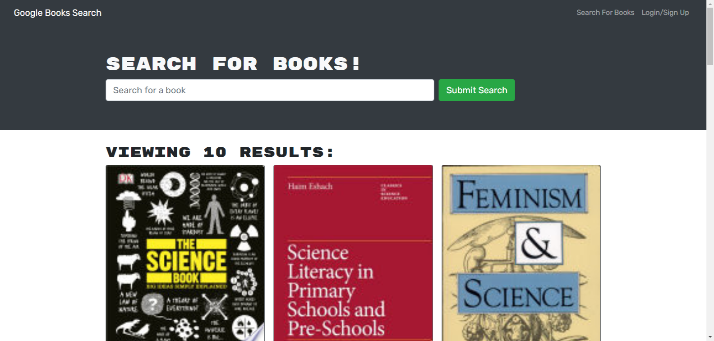

# Book-Search-Engine

### License:
  

## Description 
A Google Books API search engine where you can search for your books and save them to your profile after signing-up. 

## Tools used:
* This application is a GraphQL API built with Apollo Server.
* The app was built using the MERN stack, with a React front end, MongoDB database, and Node.js/Express.js server and API. 

## Deployed Application Link
<a href="https://agile-gorge-53423.herokuapp.com/">Click here</a>

## Screen-shot:
